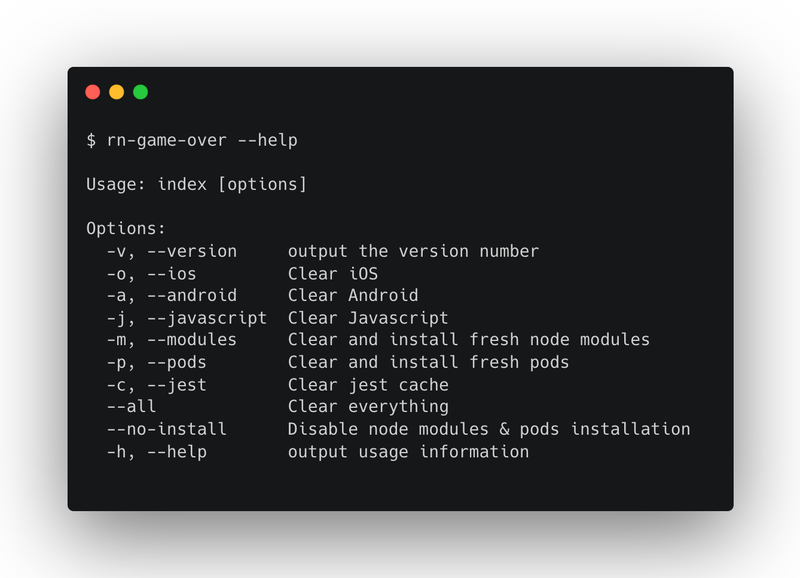

# rn-game-over

> React Native kill me. Give me an other life.

Have you ever been in this situation when changes that you made in your code, are not considered by RN in your simulator 🧐

You tried everything : delete RN cache, ios build, android build...

It generally works but you don't really know why and which command was the winner.

This package is just a script that run a set of commands for you 🤩 and save your time 🕔

## Usage



## Install

With npm, run

```
$ npm install -g rn-game-over
```

## Dependency manager

This script has command support for both [npm](https://docs.npmjs.com/cli/npm) and [yarn](https://yarnpkg.com/lang/en/).

## Options descriptions

- `-o`:

  - rm -rf ~/Library/Developer/Xcode/DerivedData/\*
  - rm -rf ~/Library/Developer/Xcode/Archives/\*
  - rm -rf ./ios/build

- `-a`:

  - ./android/gradlew clean
  - rm -rf ./android/build
  - rm -rf ./android/app/build
  - rm -rf android/.gradle
  - rm ./android/.idea/modules.xml
  - rm ./android/\*\*/\*.iml

- `-j`:

  - watchman watch-del-all
  - rm -rf $TMPDIR/haste-map-react-native-packager-\*
  - rm -rf $TMPDIR/metro-bundler-cache-\*
  - _<DEPENDENCY_MANAGER>_ cache clean
  - rm -rf ~/.rncache

- `-p`:

  - rm -rf ./ios/Pods
  - bundle exec pod install

- `-m`:

  - rm -rf ./node_modules
  - _<DEPENDENCY_MANAGER>_ install

- `-c`:

  - _<DEPENDENCY_MANAGER>_ jest --clearCache

## Contributors

<a href="https://github.com/taboulot/rn-game-over/graphs/contributors">
  
</a>

Made with [contrib.rocks](https://contrib.rocks).

## License

MIT
